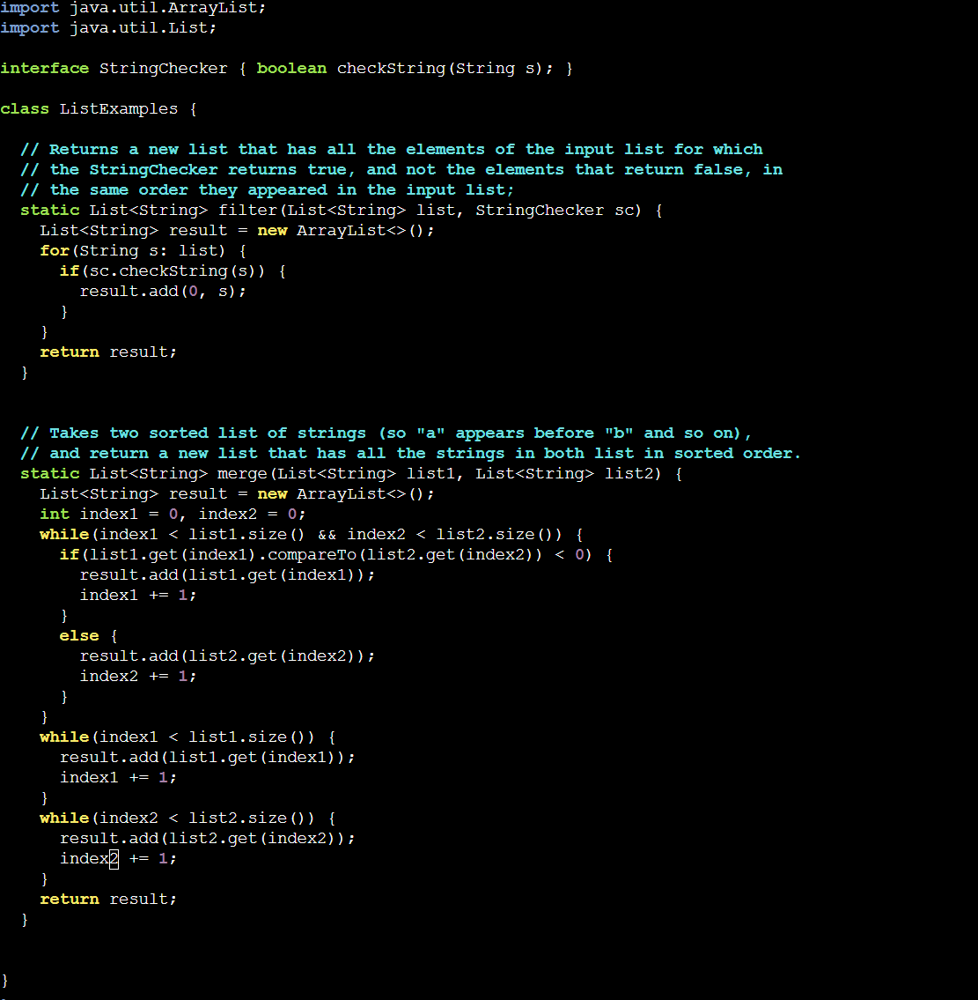

# Part 1 
__Anonymous:__ <br>
Hey everyone, I'm working on skill demo four and doing the part fixing bugs in the ListExamples.java. I already changed the last index from index 1 to index 2, but I need help with the filter method in the ListExamples class. The output list is coming out differently than expected. The bug might be related to how elements are added to the result list. Could it be a problem with the add(0, s) method inside the loop? <br>
 <br>
 <br>

__TA:__ <br>
Hi there, I'm glad you found the 'add(0,s)' has some issues. In Java's ArrayList, the 'add(0, element)' method inserts the specified element at the beginning of the list, shifting the existing elements towards the end. This operation effectively reverses the order of elements when used iteratively within a loop. The easy way to fix that is to cancel the 0 in addition. (so 'add(s)'). Try printing the elements after each addition(before and after you change add(0,s) to add(s) ) using 'System.out.println()' inside the loop to see how they're getting added. This will help you understand it more. <br>


__Anonymous:__ <br>
Thanks for the suggestion! I added System.out.println() to print the elements in the filter method after each addition. The elements are added in reverse order compared to the original list. So, when the condition is met, the elements are added to the beginning of the result list, causing the order to reverse. And that caused the output to be incorrect. <br>

 <br>
 <br>

__4.__ <br>
I chose an example where students did not know how to modify the skill demo buggy part. So, the workspace and original file environment are as follows. <br>
__O The file & directory structure needed.__ <br>
```ruby
-buggy
  -TestListExamples.java
  -ListExamples.java
  -test.sh
```
__O The contents of each file before fixing the bug.__ <br>
__TestListExamples.java__ <br>
```ruby
import java.util.ArrayList;
import java.util.List;
import java.util.Arrays;
import static org.junit.Assert.*;
import org.junit.*;

public class TestListExamples {
  @Test
  public void testFilter() {
    List<String> strs = new ArrayList<>();
    strs.add("a");
    strs.add("b");
    strs.add("apple");
    List<String> filtered = ListExamples.filter(strs, s -> s.charAt(0) == 'a');
    assertEquals(filtered, Arrays.asList("a", "apple"));
  }
  
  @Test(timeout=100)
  public void testMerge() {
    List<String> strs1 = new ArrayList<>();
    List<String> strs2 = new ArrayList<>();
    strs1.add("a"); strs1.add("b"); strs1.add("cranberry");
    strs2.add("dragon");
    List<String> merged = ListExamples.merge(strs1, strs2);
    assertEquals(merged, Arrays.asList("a", "b", "cranberry", "dragon"));
  }
}
```
__ListExamples.java__ <br>
```ruby
import java.util.ArrayList;
import java.util.List;

interface StringChecker { boolean checkString(String s); }

class ListExamples {

  // Returns a new list that has all the elements of the input list for which
  // the StringChecker returns true, and not the elements that return false, in
  // the same order they appeared in the input list;
  static List<String> filter(List<String> list, StringChecker sc) {
    List<String> result = new ArrayList<>();
    for(String s: list) {
      if(sc.checkString(s)) {
        result.add(0,s);
      }
    }
    return result;
  }


  // Takes two sorted list of strings (so "a" appears before "b" and so on),
  // and return a new list that has all the strings in both list in sorted order.
  static List<String> merge(List<String> list1, List<String> list2) {
    List<String> result = new ArrayList<>();
    int index1 = 0, index2 = 0;
    while(index1 < list1.size() && index2 < list2.size()) {
      if(list1.get(index1).compareTo(list2.get(index2)) < 0) {
        result.add(list1.get(index1));
        index1 += 1;
      }
      else {
        result.add(list2.get(index2));
        index2 += 1;
      }
    }
    while(index1 < list1.size()) {
      result.add(list1.get(index1));
      index1 += 1;
    }
    while(index2 < list2.size()) {
      result.add(list2.get(index2));
      index2 += 1;
    }
    return result;
  }
```
__test.sh__ <br>
```rubby
set -e

javac -cp .:lib/hamcrest-core-1.3.jar:lib/junit-4.13.2.jar *.java

java -cp .:lib/hamcrest-core-1.3.jar:lib/junit-4.13.2.jar org.junit.runner.JUnitCore TestListExamples
```
__O The full command line(or lines)you ran to trigger the bug.__ <br>
In this case, it is the bash test. sh, which prints. <br> 
 <br>

__O A description of what to edit to fix the bug.__ <br>
change add(0,s) to add(s) <br>


# Part 2
Most of the content in this class was new and exciting to me. For example, I have never been exposed to Vim before, and I think the person who designed the entire Vim logic is very talented and has many convenient slash options. Let me know a new way to modify files directly in the terminal. In addition, I know how to use ssh now in the terminal to access my git hub and download and upload workspace; I think it will also benefit my future Java-related work. <br>


